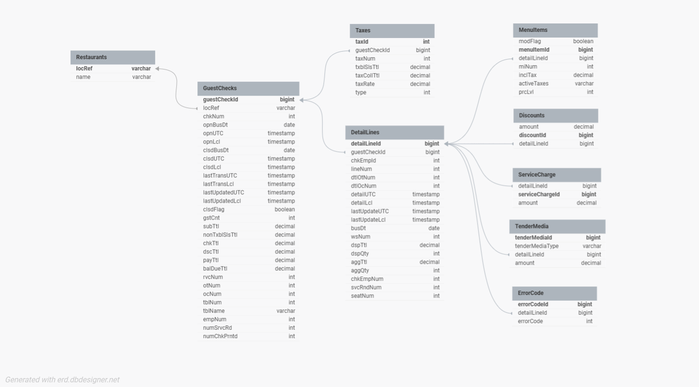

# restaurant-data-challenge

## Descrição do Desafio 

Este repositório contém a solução para o desafio de engenharia de dados realizado para o **CBLAB - Coco Bambu**.

## Estrutura do Repositório

- **sql/**: Contém os scripts SQL para a criação de tabelas e estrutura de banco de dados.
- **src/**: Contém o código-fonte para o processamento de dados, transformações e integração com a API.
- **ERP.json**: Exemplo de resposta de um endpoint de API de ERP, representando um pedido realizado em um restaurante.
- **Kanban.pdf**: Documento contendo a organização das tarefas e o progresso do projeto.
- **README.md**: Documento explicativo contendo a descrição do esquema JSON, abordagem adotada, e a estrutura do projeto.

## Desafio 1.1: Descrição do Esquema JSON

### Campos Principais:
- **curUTC**: Hora atual no formato UTC (Ex: `2024-05-05T06:06:06`).
- **locRef**: Referência do local onde o pedido foi realizado (Ex: `99 CB CB`).
- **guestChecks**: Lista contendo um ou mais pedidos (guestCheckId).
  - **guestCheckId**: Identificador único do pedido.
  - **chkNum**: Número do pedido.
  - **opnBusDt**: Data de abertura do pedido.
  - **opnUTC**: Hora de abertura no formato UTC.
  - **clsdBusDt**: Data de fechamento do pedido.
  - **clsdUTC**: Hora de fechamento do pedido no formato UTC.
  - **lastTransUTC**: Hora da última transação no formato UTC.
  - **lastUpdatedUTC**: Hora da última atualização do pedido no formato UTC.
  - **clsdFlag**: Indicador se o pedido está fechado (true/false).
  - **gstCnt**: Número de pessoas no pedido.
  - **subTtl**: Subtotal do pedido antes de impostos e descontos.
  - **chkTtl**: Total do pedido (após impostos e descontos).
  - **dscTtl**: Total de descontos aplicados.
  - **payTtl**: Total pago pelo cliente.
  - **rvcNum**: Número do funcionário responsável pelo pedido.
  - **otNum**: Número da operação do pedido.
  - **tblNum**: Número da mesa em que o pedido foi feito.
  - **tblName**: Nome da mesa em que o pedido foi feito.
  - **empNum**: Número do empregado que registrou o pedido.
  - **numSrvcRd**: Número de registros de serviço para o pedido.
  - **numChkPrntd**: Número de vezes que o pedido foi impresso.

### Campos de Taxa:
- **taxes**: Lista de taxas aplicadas ao pedido.
  - **taxNum**: Número da taxa.
  - **txblSlsTtl**: Total de vendas sujeitas a impostos.
  - **taxCollTtl**: Total de imposto coletado.
  - **taxRate**: Taxa de imposto aplicada.
  - **type**: Tipo de imposto aplicado.

### Campos de Detalhes do Item:
- **detailLines**: Lista de itens pedidos no restaurante.
  - **guestCheckLineItemId**: Identificador único do item no pedido.
  - **lineNum**: Número da linha do item no pedido.
  - **menuItem**: Detalhes sobre o item do menu solicitado.
    - **miNum**: Número do item no menu.
    - **modFlag**: Flag que indica se o item é modificado.
    - **inclTax**: Valor do imposto incluído no item.
    - **activeTaxes**: Lista de impostos aplicados ao item.

## Desafio 1.2: Contexto

No exemplo fornecido, o objeto detailLines contém um menuItem. Ele também pode conter instâncias de:
- **discount**
- **serviceCharge**
- **tenderMedia**
- **errorCode**

Foi solicitado transcrever este modelo JSON para tabelas SQL, garantindo que a estrutura faça sentido para operações de restaurante. A implementação foi realizada utilizando o MySQL como sistema de gerenciamento de banco de dados. O código para criação das tabelas está disponível no repositório, na pasta `sql`, com o nome `create_tables.sql`.

O MySQL foi escolhido pela sua simplicidade, ampla adoção e excelente suporte a projetos de pequena a média escala, sendo uma solução robusta para sistemas transacionais, como o de restaurantes.

Além disso, ajustes podem ser necessários para adaptar o código a outros SGBDs, mas ele está otimizado para execução direta no MySQL.

Caso tenha mais dúvidas ou precise de suporte para outro banco, é só avisar!

## Desafio 1.3: Descreva a abordagem escolhida em detalhes. Justifique a escolha.

### Abordagem Escolhida

A modelagem do banco de dados foi realizada com base no formato JSON fornecido, respeitando os relacionamentos e a hierarquia dos dados. Para isso, foi aplicada uma abordagem relacional, onde cada objeto JSON foi traduzido em tabelas normalizadas, com chaves primárias e estrangeiras, para garantir integridade e organização dos dados.

### Estrutura das Tabelas

- **Tabela Restaurants**: Representa as unidades do restaurante. Contém um identificador único (locRef) que serve como chave primária.
- **Tabela GuestChecks**: Armazena informações sobre pedidos (contas) realizados no restaurante. Está vinculada à tabela Restaurants por meio da coluna locRef.
- **Tabela Taxes**: Detalha os impostos aplicados a cada pedido. Referencia a tabela GuestChecks.
- **Tabela DetailLines**: Contém os itens detalhados dos pedidos. Esta tabela está vinculada à GuestChecks e serve como base para os elementos relacionados.
Tabelas Associadas a DetailLines:
- **MenuItems**: Representa os itens do cardápio vinculados a uma linha de detalhe.
- **Discounts**: Armazena os descontos aplicados aos itens.
- **ServiceCharge**: Registra as taxas de serviço aplicadas.
- **TenderMedia**: Detalha os métodos de pagamento utilizados.
- **ErrorCode**: Captura códigos de erro relacionados ao processamento das linhas.

### Diagrama do Banco de Dados

### Justificativa da Abordagem

- **Flexibilidade**: A separação em tabelas específicas para Discounts, ServiceCharge, TenderMedia e ErrorCode permite fácil expansão do sistema, como a inclusão de novos tipos de instâncias no futuro.
- **Integridade**: O uso de chaves estrangeiras assegura a consistência entre as tabelas, eliminando riscos de dados desconectados ou inválidos.
- **Desempenho**: Apesar de a estrutura ser eficiente, um conhecimento mais aprofundado do negócio poderia levar à simplificação de algumas tabelas ou até mesmo à sua fusão, otimizando consultas frequentes e reduzindo a complexidade dos joins.
Pontos de Melhoria

A implementação atual segue uma modelagem genérica e robusta, mas ajustes podem ser feitos para melhorar o desempenho e adequação às necessidades do restaurante:

- **Fusão de tabelas**: Caso algumas instâncias, como Discounts e ServiceCharge, sejam usadas com baixa frequência ou tenham poucos atributos, elas podem ser consolidadas diretamente na tabela DetailLines.
- **Indexação**: A aplicação de índices em colunas frequentemente utilizadas em filtros ou joins pode acelerar as consultas.
- **Eliminação de redundâncias**: Uma análise do uso real dos dados no sistema pode identificar tabelas ou colunas desnecessárias, simplificando a modelagem.

### Justificativa do uso do MySQL

O MySQL foi escolhido como SGBD por ser amplamente conhecido, fácil de usar e suficientemente robusto para gerenciar sistemas transacionais. Sua compatibilidade com diversos ambientes e ferramentas o torna ideal para aplicações relacionadas a restaurantes.

### Integração com o Banco de Dados MySQL via API ERP

Foi desenvolvido um script em Python, chamado `save_json_to_mysql.py`, que realiza a integração entre uma API ERP e o banco de dados MySQL. O objetivo do script é pegar o arquivo JSON, que contém os dados de um pedido feito em um restaurante, e inseri-los nas tabelas previamente criadas no banco de dados MySQL.

O script foi projetado para rodar dentro do ambiente virtual `venvCBLAB`, o qual contém todas as dependências necessárias para a execução correta da integração.

Este script foi desenvolvido para automatizar a ingestão de dados de pedidos diretamente de uma API ERP para o banco de dados MySQL. Isso permite a atualização constante e precisa das informações do restaurante, garantindo a integridade e o fluxo contínuo de dados.

A escolha do MySQL foi mantida, pois é uma solução confiável e bem-sucedida para gerenciar dados transacionais, enquanto o uso do Python permite flexibilidade e facilidade de integração com diferentes sistemas de API.

## Resumo Desafio 1

O Desafio 1 envolveu a transcrição de um esquema JSON, representando pedidos de um restaurante, para um banco de dados MySQL. A estrutura JSON foi convertida em tabelas relacionais, com foco em pedidos, itens, impostos e descontos. O objetivo foi criar uma base de dados organizada e escalável para armazenar e processar informações dos pedidos de forma eficiente, integrando esses dados com uma API ERP por meio de um script Python automatizado. O MySQL foi escolhido pela sua robustez em gerenciar dados transacionais.

## DESAFIO 2 

